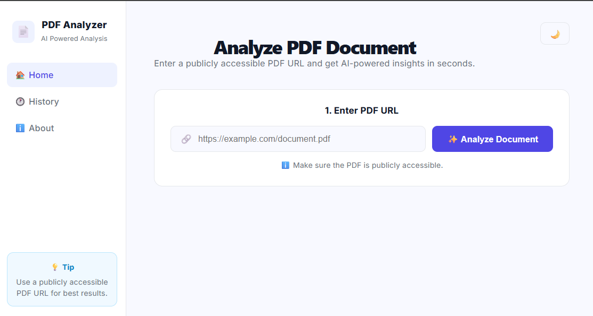
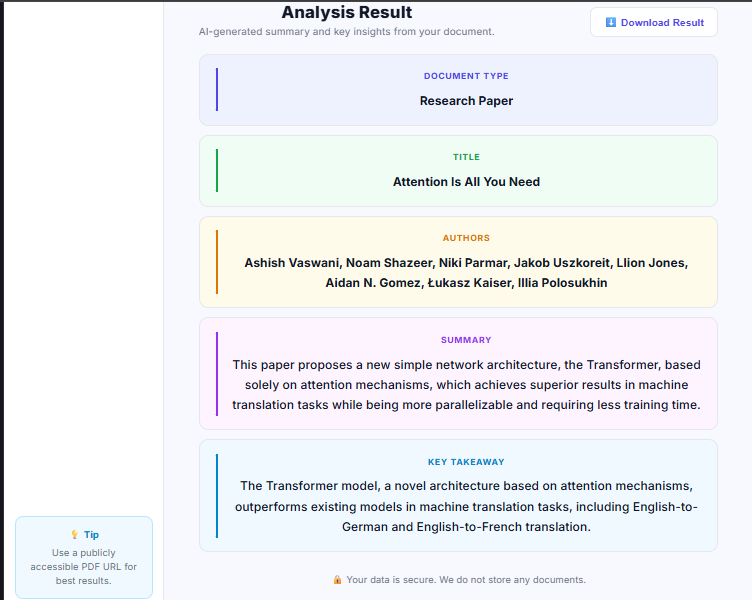

# 📄 PDF Analyzer

An AI-powered PDF analysis tool that extracts key insights from any public PDF URL instantly.

🔗 **Live Demo:** https://pdf-analyser-frontend.onrender.com

---

## ✨ Features
- 🔗 Paste any public PDF URL and get instant AI analysis
- 📋 Extracts Document Type, Title, Authors, Summary & Key Takeaway
- 🕐 Analysis history — click any row to re-analyse
- ⬇️ Download results as text file
- 🌙 Dark / Light mode toggle
- 📱 Clean responsive UI

---

## 🛠️ Tech Stack
| Layer | Technology |
|-------|-----------|
| Frontend | React 18, Vite |
| Backend | Spring Boot 3, Java 21 |
| AI Model | Groq — LLaMA 3.1 8B Instant |
| PDF Parsing | Apache PDFBox 3.x |
| Deployment | Render (Frontend + Backend) |

---

## 🏗️ Architecture
User → React Frontend → Spring Boot API → PDFBox (extract text) → Groq LLaMA → Response

---

## 🚀 How to Run Locally

### Backend
```bash
cd PDF-Analyser
./mvnw spring-boot:run
```

### Frontend
```bash
cd PDF-Analyser-frontend
npm install
npm run dev
```

### Environment Variables
```properties
# application.properties
groq.api.key=your_groq_api_key_here
```

---

## 📸 Screenshots

### Home Page


### Analysis Result


---

## 📡 API

**POST** `/api/analyse`

Request:
```json
{
  "pdfUrl": "https://arxiv.org/pdf/1706.03762"
}
```

Response:
```json
{
  "documentType": "Research Paper",
  "title": "Attention Is All You Need",
  "authors": "Ashish Vaswani...",
  "summary": "This paper proposes...",
  "keyTakeaway": "Attention mechanisms alone..."
}
```

---

## 👩‍💻 Author

**Sujitha K** — [GitHub](https://github.com/SUJITHA-K03)